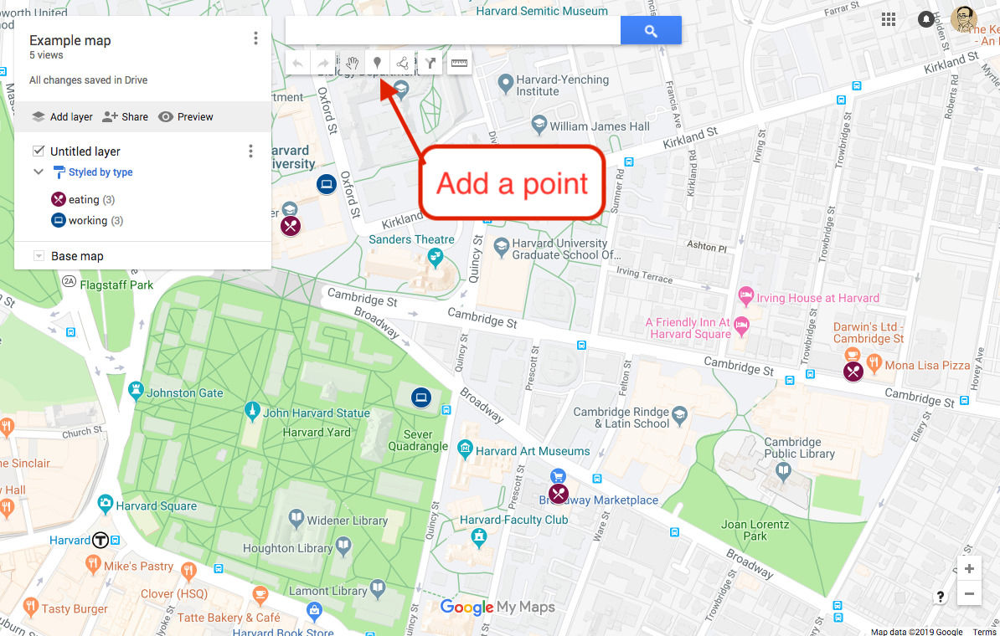

# Mapping isn't as hard as you think

Or, there's still a mountain to climb, but the view from the foothills is still \*chef kiss\*

Have you ever used a mapping or GIS application like ArcGIS or QGIS? How about a spreadsheet program like Microsoft Excel or Google Sheets? Most people have used spreadsheets before, but not mapping programs.

What if I told you that mapping doesn't have to be more complicated than working with spreadsheets? It can get quite a bit more complicated than that, but it doesn't have to for you to create an interesting map.

All you need to map a dataset is a spreadsheet with columns for latitude and longitude. Each row in your spreadsheet should represent a single place, and other columns should describe that place.

# Gathering point data spreadsheet-style

You may be asking, how can i get latitude and longitude for places? It's actually really easy to get coordinates out of Google Maps. You can right click anywhere on the map, and click "What's here?" from the pop-up menu. That will make a little box show up at the bottom of the page, which should look something like this:

You can copy and paste the coordinates from that box. You can click on them, which will put the coordinates in the search box, and which you may find easier to copy and paste from.

If you're gathering a lot of location data, you may not want to manually separate the latitude and longitude into different columns with every copy and paste. Fortunately, most spreadsheet programs have a "text to columns" feature, which you can use to split your coordinates into two columns, using the comma as a separator. The most future-proof and broadly applicable advice that I can give for that is to google "text to columns" and the name of the spreadsheet program you're using. The feature is implemented a bit differently in different programs, and interfaces seem to change every couple of years, so it's best if you get the most recent and relevant information to you.

# Gathering point data map-style

You might also want to create data for mapping with more of a map-based interface, particularly if you're starting from scratch. For that, I'd recommend [Google My Maps](https://www.google.com/mymaps). It's pretty handy.

You can create a map through Google Drive by clicking the "+ New" button, and then clicking "More", and then clicking "Google My Maps".

That will drop you into an interface with a map at the center, and a few different ways to add information. Let's start by adding a point. Navigate around the map as you would in Google Maps, and then click the "add point" button, the one with the pin icon:

Then you can click anywhere on the map to create a point. By default points have titles and descriptions. Try adding a couple of points to your map, and add titles and descriptions as you see fit.

## Adding more columns

When creating a spatial dataset, you often have more that you want to say about a point than a title and a description. Let's add some additional fields for data.

Hiding behind every data layer in your map is a table of information. We can access that table through the menu icon by the layer name:

That will give you a little popup menu, just select "Open data table" there. That will give you a spreadsheet-like view like this one:

From there, you can click the small arrow by any column header and click "insert column before" or "insert column after" to add new columns to your dataset.

These new columns will show up as fields on new points that you create, but you can also edit the properties of your points from this spreadsheet view.

## Exporting

It wouldn't do you much good to create maps here if you couldn't export them, so let's look briefly at how to do that.

First, you have to open the map options menu, which you can access from the menu icon by the map name (not to be confused with the layer options menu)

From here, select "Export to KML/KMZ", and you'll get this popup box:

I've found KML to be the more cross-compatible export format, so just check the box for KML as I've done in the screenshot and click "Download", and you'll have a file you can open in most mapping software. It can require some conversion for some programs, like the one we're about to use, but I'll come back to that later.

# Mapping with Tableau

I owe a debt of gratitude to Miriam Posner from UCLA, who has made her lesson plan for a Tableau mapping workshop openly available online. Let's follow along with her plans [here](https://github.com/miriamposner/tableau_maps_1/blob/master/make-a-map-with-tableau.md)

# More complicated mapping stuff

The data that we've been working with is the simplest form of what in GIS-world is called "vector data". Vector data is data defined by a series of instructions for how to map some spatial geometry. So far we've been using the most basic instruction, "make a point at this location". But there are more complex instructions that you can give as vector data. You can make lines by saying "connect these points with straight lines", or you can create polygons by saying "connect these points with straight lines, then connect the last one to the first one to make a closed shape". These different kinds of geometries can also be useful to you as well, and now that you have some experience making point data, the jump to more complex vector data can be easier.

Let's make some simple vector data with a site called [geojson.io](http://geojson.io/). When you first load in, you'll have an empty map and some options for drawing on it:

You can see that here we can draw lines, polygons, rectangles, and good old fashioned points. When you click on the icon for one of those geometries, you'll be able to create whatever you've selected. The interface differs a bit depending on what you're doing, and there's pop-up text to help, but here's an overview:

* For lines, click to start, then click to add points to your line. When you're finished, click the last point again to complete the line.
* For polygons, click to start, then keep clicking to add vertices to the polygon. You'll see a dotted line from the last point you added to the first, showing you where your polygon will close if you finish it. When you're done drawing, click the first point again to complete the shape.
* For rectangles, click and drag from one corner of your intended rectangle to the opposite corner. Release your mouse button to complete the rectangle.
* For points, just click anywhere to add the point you want.

You can also edit shapes after you've added them with the edit button. If you're editing a line or polygon, you'll see more points than you originally used to create the shape. The lighter points appear midway between existing points, and you can click them to add detail to your shape.

Try adding some shapes to a map, especially ones that interest you. I always map the area around where I work to start, so if you don't have any ideas, start there.

## Under the hood

As you're adding shapes, you might notice the text box next to your map filling up with strange text things, interspersed with different shapes of parentheses. That's the actual GIS file that you're creating with your drawing, in GeoJSON format. You don't have to understand it to use it, but if you're curious, you can take a look at how the vector instructions are encoded in this file format.

## Adding data

You can also add data to these shapes, although it's a bit fiddlier than Google's interface. If you enter the "Table" tab in the right hand pane, you can add columns to your dataset. Just as we added columns to our point data, we can add columns to our vector data. The difference is in how the geometry is encoded. Instead of simple lat/longs, we have more complex geometries representing places. If you like it better, geojson.io is a perfectly viable open source alternative to Google My Maps.

## Converting formats

One thing that geojson.io does really well is converting vector data formats. In fact, we can use it to convert our data from Google My Maps into a GeoJSON format that gets along well with Tableau, so you can use your data from there in really cool visualizations.

It's a pretty simple process to convert the KML that we got from My Maps. From a new map, hover over "Open", then click "File" to select the file you want to convert. Then, hover over "Save", then click "GeoJSON" to download the geojson version of the data.

You can open that file in Tableau by selecting "Spatial data" when connecting to your data. Even if you have more complex vector geometry in your dataset, you'll still be able to use Tableau to quickly make an interactive map to visualize it.
